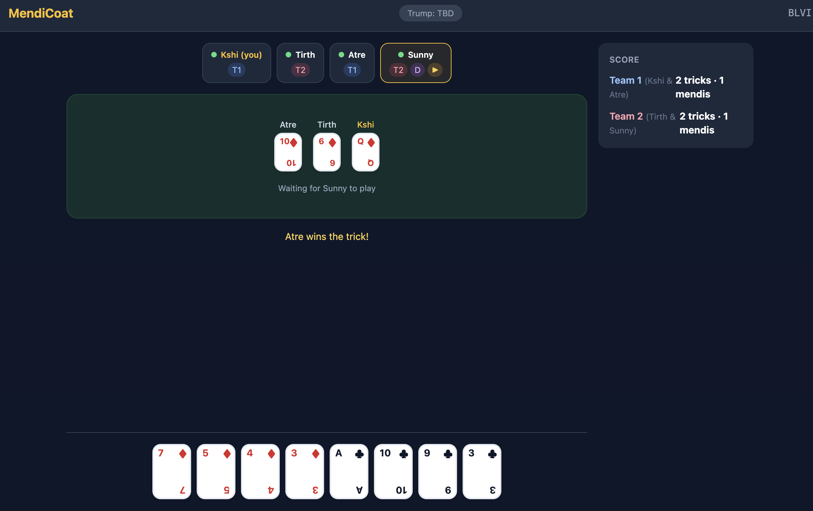

# MendiCoat

A real-time multiplayer implementation of the Indian card game Mendikot, supporting 4, 6, or 8 players across two teams.



---

## Running Locally

**Backend**
```bash
cd backend
pip install -r requirements.txt
uvicorn main:app
# Runs on http://localhost:8000
```

**Frontend** (in a separate terminal)
```bash
cd frontend
npm install
npm run dev
# Runs on http://localhost:5173
```

Then open [http://localhost:5173](http://localhost:5173) in your browser. Create a room, share the link with friends on the same network (or deploy to share publicly).

---

## Tech Stack

| Layer | Tech | Why |
|---|---|---|
| Frontend | React + TypeScript | Component model maps well to game UI |
| Backend | Python + FastAPI | Async WebSocket support, clean API |
| Real-time | WebSockets (native FastAPI) | Push-based, essential for card games |
| State | In-memory (Python dicts) | No DB needed — game state is ephemeral |

**No database required.** Rooms exist only while players are connected. There are no user accounts, persistent history, or leaderboards. All state lives in server memory as `room_id → GameState`. A server restart ends active games, which is acceptable for a casual friends game.

---

## Code Structure

```
mendikot/
├── backend/
│   ├── main.py                  # FastAPI app + WebSocket endpoint
│   ├── game/
│   │   ├── room_manager.py      # Dict of active rooms, create/join/cleanup
│   │   ├── game_state.py        # State machine: LOBBY → PLAYING → DONE
│   │   ├── deck.py              # Shuffle, deal, remove 2s for 6/8 players
│   │   ├── trick.py             # Trick winner logic, trump resolution
│   │   └── scoring.py           # Ten counting, mendikot detection, next dealer
│   └── models/
│       ├── player.py            # name, hand, team, ws connection
│       ├── card.py              # suit, rank, comparison logic
│       └── room.py              # room_code, players, game_state
│
└── frontend/
    └── src/
        ├── pages/
        │   ├── Home.tsx          # Create room (pick player count + name) or join
        │   ├── Lobby.tsx         # Waiting room, shows who joined, host starts
        │   └── Game.tsx          # Main game screen
        ├── components/
        │   ├── Hand.tsx          # Your cards, clickable when it's your turn
        │   ├── Table.tsx         # Current trick, all played cards
        │   ├── PlayerSlots.tsx   # Visual seating arrangement
        │   ├── ScoreBoard.tsx    # Tens captured, trick count
        │   └── TrumpBadge.tsx    # Shows trump suit once established
        ├── hooks/
        │   ├── useWebSocket.ts   # Connection, reconnect, message dispatch
        │   └── useGameState.ts   # Reducer over incoming WS events
        └── context/
            └── GameContext.tsx   # Shared state across components
```

---

## Game Flow

```
Host creates room (picks 4/6/8 players, enters name)
  → Server creates room_code, host joins as player[0]
  → Host shares invite link

Friends join via link (enter name)
  → Server broadcasts player_joined to all in room
  → Lobby shows connected players

Host clicks "Start" (when room is full)
  → Server shuffles deck, deals hands, broadcasts game_started
     (each player receives only their own hand)

Game loop:
  Player whose turn it is plays a card
  → Server validates (correct turn? must follow suit?)
  → If valid: broadcasts card_played, checks for trump trigger
  → After n cards: resolves trick, broadcasts trick_done
  → Repeat until all tricks played
  → Server scores, broadcasts round_over
  → Next dealer determined, option to play again
```

---

## WebSocket Message Protocol

Every message has a `type` and `payload`. The server is always authoritative — the client sends intent and the server validates, resolves, and broadcasts results.

```
Client → Server                  Server → All Clients (broadcast)
─────────────────────────────    ────────────────────────────────────────────
create_room                      room_created   { room_code }
join_room                        player_joined  { players[] }
start_game                       game_started   { your_hand[], seat_order[] }
play_card                        card_played    { player, card, next_turn }
                                 trump_set      { suit, triggered_by }
                                 trick_done     { winner, team, tricks_so_far }
                                 round_over     { scores, next_dealer }
```

Note: `game_started` sends different payloads to each connection — each player receives only their own hand, never others'.

---

## Invite Link Flow

```
Host → POST /room → { room_code: "XK7F" }
Shareable link: https://yourdomain.com/join/XK7F

Guest opens link → sees player count, enters name → connects via WebSocket
```

---

## Key Implementation Details

### Server is Authoritative
Never trust the client. Card plays, turn validation, and trump determination all happen server-side. The client only sends intent (`play_card`); the server validates and broadcasts the result.

### Trump via Cut Hukum
The server tracks a `trump_suit: str | None` flag. When a player plays off-suit, the server checks if this is the first off-suit play. If so, that card's suit becomes trump and `trump_set` is broadcast to all players.

### Anticlockwise Turn Order
Players are stored in seated order. Turn progression goes `index - 1 (mod n)`, not `+1`. This affects trick leading, dealing, and next-dealer logic — get it right early.

### Team Assignment
Teams are always every alternate seat:
- 4 players: seats [0, 2] vs [1, 3]
- 6 players: seats [0, 2, 4] vs [1, 3, 5]
- 8 players: seats [0, 2, 4, 6] vs [1, 3, 5, 7]

### Deck Variants
- 4 players: standard 52-card deck, 13 cards each
- 6 players: 48-card deck (four 2s removed), 8 cards each
- 8 players: 48-card deck (four 2s removed), 6 cards each

### Hand Privacy
Each player only receives their own hand over their own WebSocket connection. Never broadcast all hands. The `game_started` event sends different payloads to each individual connection.

### Disconnection Handling
Store the WebSocket connection on the player object. On disconnect, pause the game and wait for reconnect (identified by room code + name). Apply a timeout after which the game is abandoned and the room is cleaned up.

### Scoring
- Winning team is the one that captures 3 or 4 tens
- If each team has 2 tens, the team with 7+ tricks wins
- Capturing all 4 tens = **Mendikot** (a superior win)
- Capturing all 13 tricks = **Mangya Coat** (whitewash)
- Next dealer rule: if dealer's team loses, same player deals again (unless whitewashed, then partner deals); if dealer's team wins, deal passes to the right

---

## What's Not Needed

- **No database** — in-memory state is correct for this use case
- **No auth or JWT** — room code + player name is the identity
- **No REST API beyond room creation** — everything after joining is WebSocket
- **No Redis or external cache** — a single server process holds all room state
